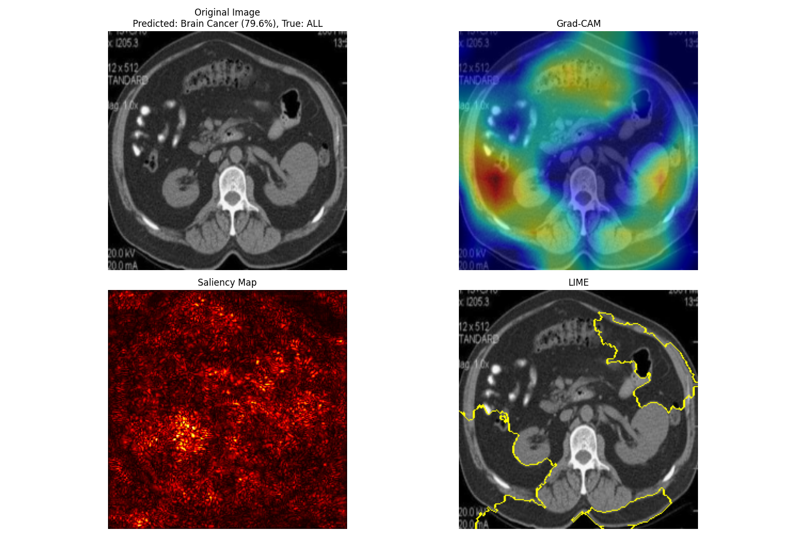

# Medical-XAI-Cancer-Detection
End-to-end cancer classification using VGG16 with Explainable AI (Grad-CAM &amp; LIME) for diagnostic interpretability.
# Interpretability-First Cancer Detection Pipeline

Developed a deep learning diagnostic system to classify 8 cancer types from MRI scans, prioritizing **Explainable AI (XAI)** for clinical decision support.

## 🔬 Diagnostic Visualization (XAI)

*Figure: Side-by-side comparison showing how Grad-CAM and LIME identify the specific features used for classification.*

## 🚀 Key Features
* **Architecture:** Fine-tuned **VGG16** backbone with custom top layers for multi-class classification.
* **Explainability:** Integrated **Grad-CAM** and **LIME** to generate high-resolution diagnostic heatmaps.
* **Engineering:** Custom **NumPy-aware JSON encoder** for high-precision tensor serialization.
* **Hardware Optimization:** Resolved **AVX instruction set** bottlenecks through a migrated cloud-inference workflow.

## 📦 Model Weights
Large-scale model artifacts and the full VGG16 checkpoint are managed externally due to GitHub size constraints.

Access Model: [Google drive link](https://drive.google.com/file/d/114Hq7VX7BtYmcLMszdYiUM1pXc8oCBtg/view?usp=sharing)] for local testing.

---
